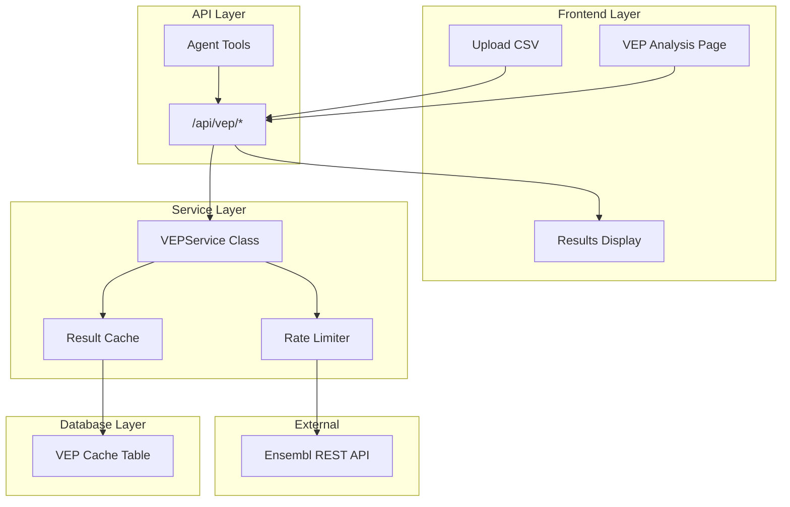

<!-- ccf5c960-ff57-4618-a065-3565152b71ad 59825d7e-6a88-4238-b2ec-e93c4b3a7162 -->
# VEP (Variant Effect Predictor) Integration Plan

## Architecture Overview



## Implementation Components

### 1. Service Layer - `services/vep_service.py`

Core VEP integration service with:

- **Rate limiting**: Respect Ensembl's 15 req/sec limit with exponential backoff
- **Batch processing**: Handle 200 rsIDs per request (Ensembl limit)
- **Result caching**: Avoid redundant API calls for previously analyzed SNPs
- **Error handling**: Graceful degradation on API failures
- **Response parsing**: Transform VEP JSON into GenovaAI-friendly format

Key methods:

- `get_single_variant(rs_id)` - Analyze one SNP
- `get_batch_variants(rs_ids)` - Analyze up to 200 SNPs
- `analyze_patient_csv(csv_path, limit)` - Process uploaded CSV files
- `_parse_vep_result(result)` - Standardize response format

### 2. API Routes - `routes/vep_routes.py`

New Blueprint with endpoints:

| Endpoint | Method | Description |

|----------|--------|-------------|

| `/api/vep/analyze-snp` | POST | Single SNP analysis |

| `/api/vep/analyze-batch` | POST | Multiple SNPs (up to 200) |

| `/api/vep/analyze-file` | POST | Analyze patient CSV file |

| `/api/vep/status` | GET | Check VEP service status |

| `/api/vep/cache-stats` | GET | View cache statistics |

### 3. Database Model - `database/models.py`

Add `VEPAnnotation` model for caching:

```python
class VEPAnnotation(db.Model):
    rs_id = db.Column(db.String(20), primary_key=True)
    most_severe_consequence = db.Column(db.String(100))
    impact = db.Column(db.String(20))
    gene_symbol = db.Column(db.String(50))
    cadd_phred = db.Column(db.Float)
    population_frequencies = db.Column(db.Text)  # JSON
    full_response = db.Column(db.Text)  # JSON
    cached_at = db.Column(db.DateTime)
    expires_at = db.Column(db.DateTime)
```

### 4. Agent Tools - `agent/tools.py`

Add new tools for AI agent:

- `analyze_snp_effects(sample_file, limit)` - Get biological effects of SNPs
- `get_variant_pathogenicity(rs_id)` - Get CADD score and clinical significance
- `get_population_frequencies(sample_file)` - Compare patient alleles to populations

### 5. Frontend Template - `web/templates/vep_analysis.html`

New page displaying:

- Impact severity distribution (HIGH/MODERATE/LOW/MODIFIER)
- Gene annotations table with filtering
- CADD score visualization
- Population frequency comparisons (patient vs reference populations)
- Export results to JSON/CSV

### 6. Blueprint Registration - `routes/__init__.py`

Register new VEP blueprint in the existing pattern.

## Files to Create/Modify

| File | Action | Description |

|------|--------|-------------|

| [`services/vep_service.py`](services/vep_service.py) | Create | Core VEP API integration |

| [`routes/vep_routes.py`](routes/vep_routes.py) | Create | API endpoints |

| [`routes/__init__.py`](routes/__init__.py) | Modify | Register VEP blueprint |

| [`database/models.py`](database/models.py) | Modify | Add VEPAnnotation model |

| [`agent/tools.py`](agent/tools.py) | Modify | Add VEP-related tools |

| [`web/templates/vep_analysis.html`](web/templates/vep_analysis.html) | Create | Results display page |

| [`config/settings.py`](config/settings.py) | Modify | Add VEP configuration options |

## Error Handling Strategy

1. **Network failures**: Retry with exponential backoff (3 attempts)
2. **Rate limiting (429)**: Automatic delay and retry
3. **Invalid rsIDs**: Return partial results with error list
4. **API unavailable**: Fall back to cached data if available
5. **Large files**: Process in chunks with progress tracking

## Configuration Options

Add to environment variables:

- `VEP_CACHE_TTL` - Cache expiration (default: 7 days)
- `VEP_BATCH_SIZE` - SNPs per batch (default: 200)
- `VEP_RATE_LIMIT` - Requests per second (default: 15)
- `VEP_ENABLED` - Feature toggle (default: true)

## Testing Considerations

- Unit tests for VEPService methods
- Integration tests with mocked Ensembl API
- Rate limiter validation
- Cache expiration logic

### To-dos

- [ ] Create services/vep_service.py with rate limiting, caching, and batch processing
- [ ] Create routes/vep_routes.py with API endpoints and register blueprint
- [ ] Add VEPAnnotation database model for caching VEP results
- [ ] Add VEP-related tools to agent/tools.py
- [ ] Create vep_analysis.html template with results visualization
- [ ] Add VEP configuration options to settings.py